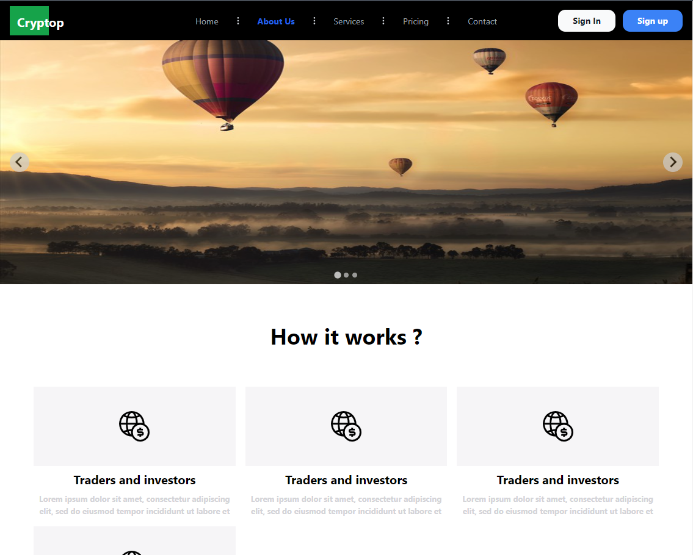

<h1 align="center" id="title">Tailwind simple templete</h1>

<p id="description">My first templete design</p>

<h2>🚀 Demo</h2>

[https://tailwind-simple-templete-7pbel1g4r-amir-hamzas-projects.vercel.app/](https://tailwind-simple-templete-7pbel1g4r-amir-hamzas-projects.vercel.app/)

<h2>Project Screenshots:</h2>



<h2>🛠️ Installation Steps:</h2>

<p>1. First install node modules</p>

```
npm i --save
```

<p>2. Run project</p>

```
npm run build
```

  
  
<h2>💻 Built with</h2>

Technologies used in the project:

*   Html
*   Tailwind
*   Javascript
